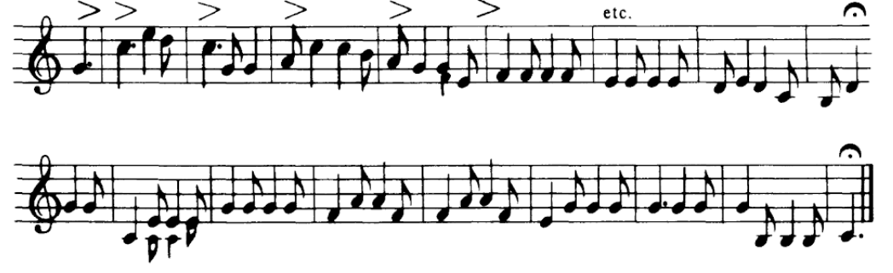

# mcginty
Web3 Integration Tests

## Dependencies

* [Web3.js]()
* [Commander.js](https://github.com/tj/commander.js)
* [Chalk](https://github.com/chalk/chalk)

## Helpful

* [A guide to creating a NodeJS command-line package](https://medium.com/netscape/a-guide-to-create-a-nodejs-command-line-package-c2166ad0452e)

### Music

> Hi, hi, went the drum! Diddle, diddle, went the fiddle,
> And the jing-a-ring went up and doon and back and through the middle, 
> And the jing-a-ring went round aboot like sheelicks in a riddle
> At M'Ginty's meal and ale, noo we a' come in to see. 

-- Sheelicks from [_Travellers Songs from England and Scotland_ By Ewan Maccoll & Peggy Seeger](https://www.amazon.com/Travellers-England-Scotland-Routledge-Editions/dp/1138183938), 1977
